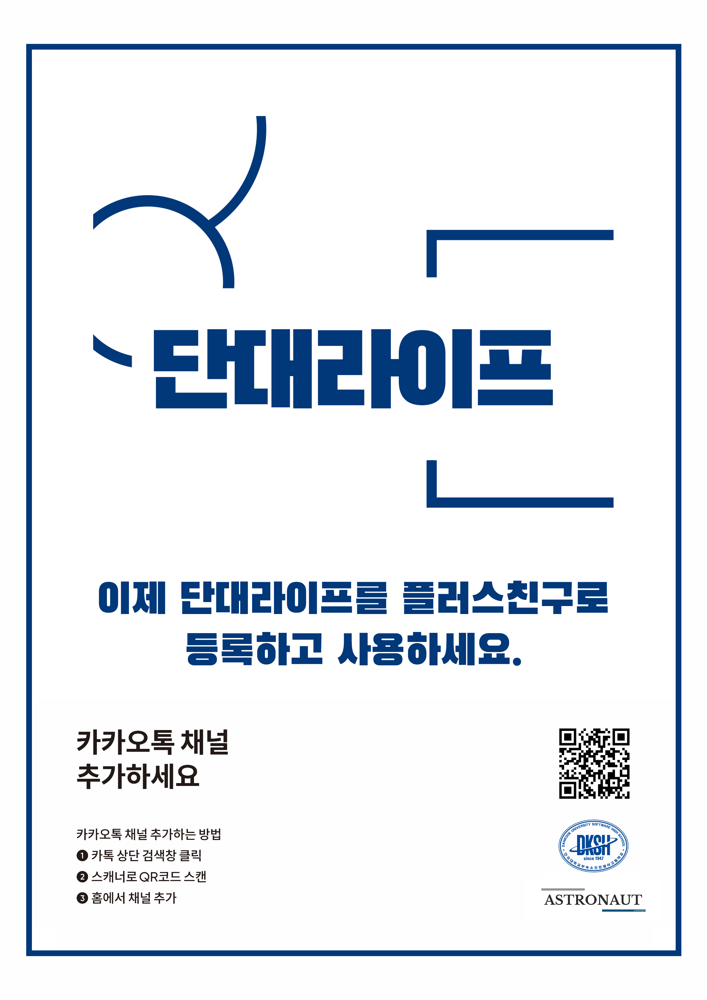

<div align="center">

<h1><b>DKSH KAKAO OPEN BUILDER CHAT BOT</b></h1>
<p>👨🏻‍💻 단국대학교부속소프트웨어고등학교 카카오톡 i 오픈빌더 챗봇 👨🏻‍💻</p>


</div>
<br>

# 1. Introduce
Hello, Guys!

This is a KakaoTalk Chat Bot that provides information about Dankook Univ. Software High School

Nice to meet you! Do you have any questions?

# 2. git-clone
```shell
$ git clone https://github.com/kitae0522/DKSH-KAKAO-i.git
```

# 3. Folder Structure
```shell
.
├── resource
│   ├── DKSHLIFE.png
│   ├── error[1].png
│   ├── error[2].png
│   ├── maybeyouwant.png
│   ├── meal.png
│   ├── poster.png
│   ├── poster2.png
│   ├── song.png
│   ├── timetable.png
│   ├── wantMeal.png
│   ├── wantTimetable.png
│   ├── wantWeather.png
│   └── weather.png
├── sample
│   ├── meal_error.jpg
│   ├── meal_success.jpg
│   ├── time_table_success.jpg
│   ├── weather_error.jpg
│   └── weather_success.jpg
├── .gitignore
├── LICENSE
├── main.py
├── README.md
├── requirements.txt
├── runtime.txt
└── time_table.csv
```

# 4. Main Function
| # | Func Name | what it does | `keyword` | using example | Entity Name |
| :---: | :---: | :---: | :---: | :---: | :---: |
| 1 | load today meal | recall meal menu information | `오늘` | `오늘 급식 알려줘`, `오늘 급식` ... | `sys_date` |
| 2 | load time table | recall timetable information. | `1학년`, `2학년`, `1반`, `2반`, `월요일` ... | [look sample image](https://github.com/kitae0522/DKSH-KAKAO-i/blob/main/sample/time_table_success.jpg) | `sys_date`, `set_grade`, `set_class` |
| 3 | load weather | recall regional weather information. | `대치동`, `성동구`, `서울` ... | [look sample image](https://github.com/kitae0522/DKSH-KAKAO-i/blob/main/sample/weather_success.jpg) | `sys_location` |

# 5. Use Example
<div align="center">


</div>

# 6. Development Environment
- Lang : Python 3.6
- Web Framework : flask
- IDE/CodeEditor : Visual Studio Code
- Server : goormIDE (After a while we create a web server in Raspberry Pi.)

# 7. How to use this?
- Development >
```shell
$ git clone https://github.com/kitae0522/DKSH-KAKAO-i.git
$ pip3 install -r requirments.txt
$ python3 main.py
```

- User >
  - Kakao Plus ID : @dkshlife
  - Kakao Plus Profile Link : [https://pf.kakao.com/_VvPXxb](https://pf.kakao.com/_VvPXxb)

# 8. Developer Info

- Developer : [@kitae0522](https://github.com/kitae0522)
- Feedback : kitae040522@gmail.com or leave an issue
- Git : [http://github.com/kitae0522/DKSH-KAKAO-i](http://github.com/kitae0522/DKSH-KAKAO-i)
